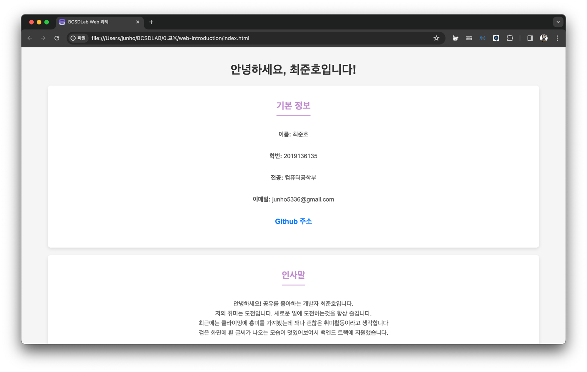

# web-introduction

이번 과제는 HTML 태그를 활용한 웹페이지 제작을 수행합니다.
이 웹페이지는 자기소개에 대한 정보와 Web에 대한 내용을 설명하는 페이지입니다.
정보를 자신의 정보에 맞게 적절히 수정하여 Pull Request를 제출해보세요!

## 요구사항

* 레포지토리를 fork하여 자신의 저장소에서 작업을 수행합니다.
* fork한 레포지토리를 clone 하여 `index.html` 파일에 비어있는 요구사항에 맞게 정보를 채워넣습니다.
* 수행한 작업 단위로 커밋을 수행합니다.
  * ex) `feat: 자기소개 문구 수정`
* Pull Request를 작성합니다.

## Hint

### 내가 작성한 코드 확인하기

index.html 더블클릭하거나 파일을 브라우저로 드래그하여 열어볼 수 있습니다.

### HTML 태그

아래 사이트에서 다양한 HTML 태그에 대한 내용들을 확인해볼 수 있습니다.

https://developer.mozilla.org/ko/docs/Web/HTML/Element
